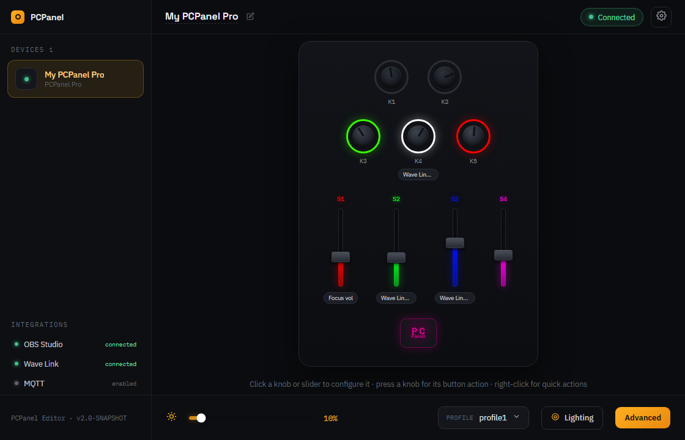
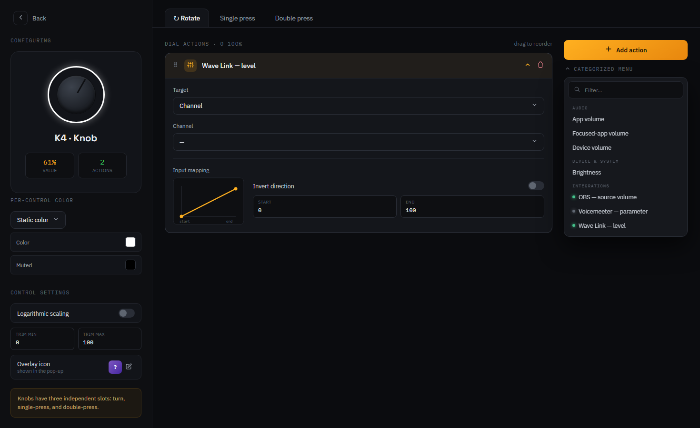
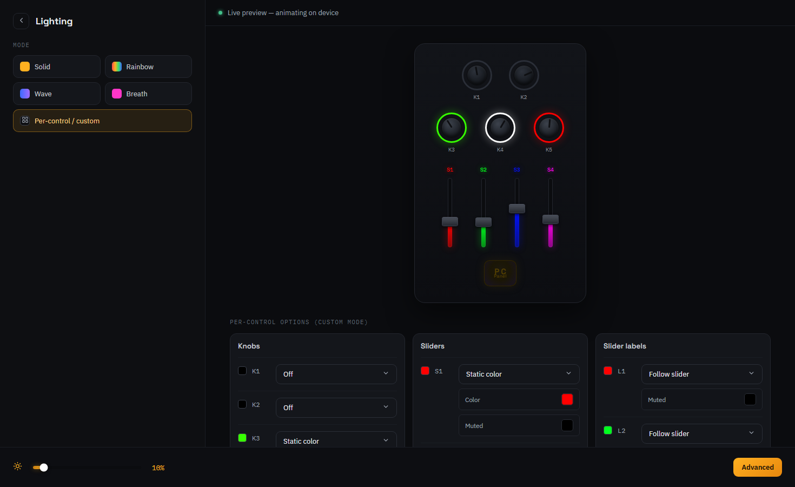

# PCPanel — Community Edition

Turn the knobs, sliders and buttons on your [PCPanel](https://getpcpanel.com) into physical
controls for everything on your PC: per-app volume, your microphone, OBS scenes, media playback,
keyboard shortcuts and more.

This is **third-party, community-maintained** software for PCPanel hardware. It is a drop-in
alternative to the official app that adds features and bug fixes requested by the community.

> **Not affiliated with PCPanel / getpcpanel.com.** The original, official software lives
> [here](https://www.getpcpanel.com/download). This project's version numbering is independent —
> it started at 1.0 from a fork of the official 2.2.1 release.



<!-- Optional future hero shot: a photo of the PCPanel hardware on a desk next to this window,
     to drive home "physical knobs ↔ on-screen controls". Place at docs/images/hero.png. -->

## What it does

A PCPanel is a small USB desk controller with knobs, sliders and buttons — many with RGB lighting.
On its own the hardware does nothing; this app is the brain that decides what each control should do.

You bind each knob, slider and button to an action, and the app translates physical movement into
real changes on your system in real time:

- **Per-application volume** — give Discord, Spotify, your game and your browser each their own
  physical knob. Mute with a button press.
- **Device & default-output control** — set the volume of any output/input device, toggle mute, or
  flip the Windows default playback device from a button.
- **"Focused app" volume** — one knob that always controls whatever window you're currently using.
- **Media & keyboard** — play/pause/skip, send any keystroke or shortcut combo, launch or close a
  program.
- **RGB lighting** — pick colors per control, with effects, and a global brightness knob.
- **Profiles** — keep different mappings for gaming, streaming and work, and switch between them
  from a button (or have them switch automatically).
- **Integrations** — drive **OBS** (scenes, source mute, source volume), **Voicemeeter**, Elgato
  **Wave Link**, and send/receive **OSC** and **MQTT** for stream-deck and home-automation setups.

An optional on-screen **overlay** briefly shows the level as you turn a knob, and the app lives in
the **system tray** so it stays out of your way.

Click any control to configure it. Each knob has independent **turn**, **single-press** and
**double-press** slots, an input-mapping curve, and per-control color — and you pick an action from a
categorized menu covering audio, system and every integration:



Light the device however you like — solid, rainbow, wave, breath, or fully per-control colors — with
a live preview that animates on the hardware as you edit:



### Supported hardware

The PCPanel **Mini**, **Pro** and **RGB** are all supported out of the box, with zero setup — just
plug in over USB (no drivers required; the device is a standard USB HID peripheral).

The app is no longer PCPanel-only. A generalized **device layer** lets other controllers drive the
same actions through the same UI, described by their capabilities (which knobs/sliders/buttons they
have, their value ranges, and any lights):

- **Deej** — the open-source Arduino [serial volume mixer](https://github.com/omriharel/deej). Add it
  by choosing its serial port; each slider binds to the same actions as a PCPanel dial. (Deej is
  sliders only — no buttons or lights.)
- **MIDI controllers** *(in progress)* — faders, knobs and pads from a standard MIDI device.

PCPanel hardware keeps its tailored, zero-configuration experience; PCPanel simply becomes one of
several device "providers".

## Download & install

Grab the latest installer from the [**Releases**](https://github.com/nvdweem/PCPanel/releases) page.
The newest stable release is pinned at the top; in-progress development builds are published as
`snapshot` pre-releases on the same page. Each release lists a changelog and a set of download assets.

The app ships as a self-contained native executable — **no Java installation is required.**

| Platform | Asset | Notes |
|----------|-------|-------|
| **Windows** | `PCPanel-<version>-setup.exe` | Recommended. See below. |
| **Linux** | `pcpanel_<version>_amd64.deb` (or Flatpak / AppImage) | Best-effort — see [linux.md](linux.md). |
| **macOS** | `PCPanel-<version>-<arch>.dmg` | Experimental — see [mac.md](mac.md). Pick `aarch64` for Apple Silicon, `x86_64` for Intel. |

> The `Source code` asset attached to releases is not needed to run the app.

### Windows

Run `PCPanel-<version>-setup.exe`. It's a **per-user install** — no administrator rights needed; it
installs into your user profile (`%LOCALAPPDATA%`). The installer can launch the app when it finishes
and offers to start PCPanel automatically when you sign in to Windows. You can optionally grant it
administrator privileges at login (set up as a scheduled task), which is required if you want PCPanel
to control the volume of apps that run elevated.

### Linux

Linux is best-effort. Device access needs udev rules and a couple of helper packages; the `.deb`
handles most of this for you. Full instructions, including autostart and Wayland tray setup, are in
[linux.md](linux.md).

### macOS

macOS support is experimental and community-contributed. Device volume, mute and default-device
switching work; per-application volume is not possible on stock macOS. The app is unsigned, so
Gatekeeper needs a one-time workaround. See [mac.md](mac.md) for installation and required
permissions.

## Migrating from the official app

On first launch the app looks for a profile from the official software and offers to import it. If
that doesn't happen automatically, or you want to redo it later, copy the settings file manually:

```text
from:  %localappdata%\PCPanel Software\save.json
to:    %userprofile%\.pcpanel\profiles.json
```

## Help & feedback

- **Something broken, or an idea for a feature?** Open an issue on the
  [issue tracker](https://github.com/nvdweem/PCPanel/issues). The issue templates list the
  information that helps most — please be as complete as you can.
- **Want to hack on it?** See [CONTRIBUTING.md](CONTRIBUTING.md) for build and development setup.
</content>
